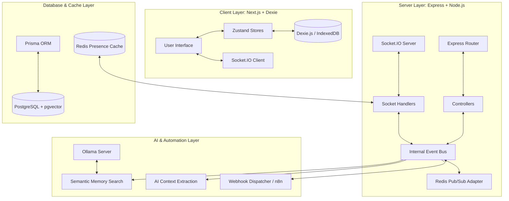
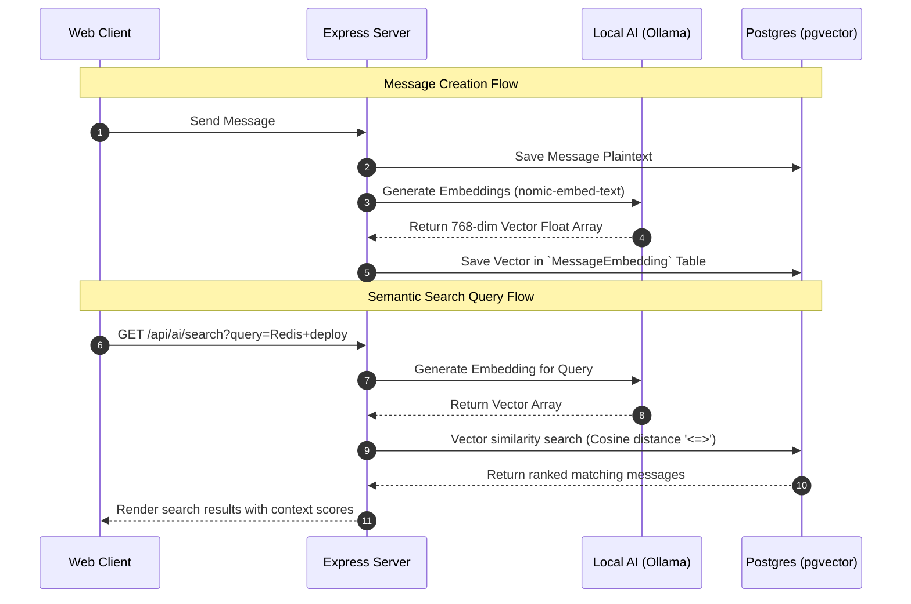

# Synq — Master Implementation Plan (Web First)

This document maps the evolution of Synq from a real-time messaging application into a high-performance, **AI-native, event-driven communication and automation infrastructure**.

---

## Architecture Overview



---

## Phase 0 — Core Foundation (Completed)
The base platform is stable and provides offline-first, low-latency, encrypted messaging capabilities.

* **Real-time Transport**: Socket.IO client-server bridge with auto-reconnection.
* **Database Cache**: Dexie.js (IndexedDB) for local message caching and offline message queues.
* **Offline Synchronization**: Automatic sync server reconciles missing messages upon reconnection.
* **Presence & Scalability**: Redis-backed presence tracking using hashed counters (multi-tab safe) and Socket.IO horizontal scaling adapter.
* **Optimistic UI**: Dynamic local database mutations to display messages immediately.
* **Pagination**: Cursor-based database queries using message timestamps.

---

## Phase 1 — Internal Event Architecture (DONE)
> [!IMPORTANT]
> **Priority: Very High (Immediate Next Step)**  
> Decouple chat features, AI tasks, and third-party integrations using a publish-subscribe (PubSub) architecture.

### Objectives
* Transition the backend from a monolithic structure to an event-driven system.
* Allow AI models, automations, and background workers to register as event listeners without cluttering HTTP controllers or Socket handlers.

### Directory Structure
```
synq-server/src/
 ├── events/
 │    ├── eventBus.ts         # Main EventEmitter / PubSub dispatcher
 │    ├── publishers/        # Functions to trigger events
 │    └── subscribers/       # Event handlers (AI, metrics, webhooks)
```

### Core Event Schema
* `message.created` / `message.updated` / `message.failed`
* `message.read` / `message.delivered`
* `user.online` / `user.offline`
* `chat.created` / `chat.deleted`
* `ai.summary.requested`
* `task.detected`

---

## Phase 2 — AI Memory & Semantic Search (DONE)
> [!IMPORTANT]
> **Priority: Extremely High**  
> Move beyond keyword searching and implement vector similarity search to let users search by conceptual meaning.



### Database Stack
* **Database**: PostgreSQL with `pgvector` extension enabled.
* **Embedding Model**: `nomic-embed-text`, `bge-small-en-v1.5`, or `jina-embeddings-v2` served locally via Ollama.
* **Vector Dimension**: 768 or 384 dimensions.

### Core API Contracts
* `POST /api/ai/search`: Accepts query text, generates an embedding, and runs cosine distance matching.
* `POST /api/ai/embed`: Helper endpoint to generate raw text embeddings.

---

## Phase 3 — AI Command System (DONE)
> [!TIP]
> **Priority: High**  
> Implement natural language slash commands to let users command the workspace from their chat bar.

### Commands List
* `/summarize [all|unread|<hours>]` - Summarizes conversation history.
* `/search <meaning>` - Triggers a semantic vector search query.
* `/todo` - Displays automated tasks extracted from the channel.
* `/translate <lang>` - Translates selected messages.
* `/explain [code|term]` - Queries the LLM for explanations of highlighted code blocks.

### Architecture
```
Message Input → Regex Command Parser → Command Router → Tool Orchestration Engine → Chat Output
```

---

## Phase 4 — AI Context Extraction (DONE)
> [!NOTE]
> **Priority: High**  
> Automatically analyze chat histories in the background to capture workspace metadata.

* **Trigger**: Listens to the `message.created` event on the Event Bus.
* **AI Analysis**: Runs the message through a local LLM prompt configured to extract structured JSON data.
* **Target Entities**:
  * **Tasks & Actions**: "Deploy code" / "Submit report".
  * **Deadlines**: "By Friday at 5 PM".
  * **Meetings & Events**: "Let's sync tomorrow morning".
  * **Code snippets & URLs**.
* **Storage**: Saves extracted tasks and schedule entries in Postgres, linking them back to the source message.

---

## Phase 5 — Automation & Trigger Layer (DONE)
> [!NOTE]
> **Priority: High**  
> Seamlessly execute third-party workflows when specific events are detected in chat threads.

* **Architecture**: The Event Bus routes chosen events to an `AutomationService`.
* **n8n / Webhooks Integration**: Integrates directly with n8n workflow nodes.
* **Example Automation Flows**:
  * **Meeting Detected**: Create Calendar Event → Generate Invite Link → Post confirmation back to chat.
  * **Github Bug Discussion**: Extract code traceback → Open GitHub Issue → Trigger GitHub Action build.

---

## Phase 6 — AI Agent Layer (OpenClaw)
> [!NOTE]
> **Priority: Medium-High**  
> Empower autonomous agents to act on behalf of the user using sandboxed execution tools.

* **Agent Engine**: **OpenClaw** or LangChain reasoning runtime.
* **Agent Capabilities (Tools)**:
  * `search_messages(query: string)`
  * `search_files(mime: string, name: string)`
  * `create_task(title: string, date: string)`
  * `trigger_workflow(id: string)`

---

## Phase 7 — Desktop Companion App (Tauri)
> [!NOTE]
> **Priority: Medium**  
> Unlocks indexing files on the user's host operating system.

* **Tech Stack**: **Tauri (Rust / React)** packaging the Next.js frontend.
* **Local Indexer**: Rust background threads monitor filesystem folders.
* **Metadata Store**: SQLite locally storing filepath, filename, filetype, and embedding tags.

---

## Phase 8 — Contextual File Retrieval
> [!CAUTION]
> **Priority: Medium**  
> Provide semantic matching for documents stored on the desktop.
> 
> **Important Security Rule**: NEVER auto-send files from the desktop. The agent should only search, locate, and **suggest** the file in the chat input. The user must click to approve and send.

---

## Phase 9 — Security Architecture
> [!CAUTION]
> **Priority: Very High**  
> Hardens user data, session states, and storage mediums.

* **Key Exchanges**: Implement `libsodium` / `X25519` diffie-hellman handshakes.
* **Message Encryption**: Native `AES-256-GCM` or `ChaCha20-Poly1305` encryption.
* **Local Storage Encryption**: SQLite encryption (SQLCipher) for Tauri desktop and encrypted Dexie middleware wrappers.

---

## Phase 10 — Local-First Distributed Sync (CRDTs)
> [!TIP]
> **Priority: Elite / Long-Term Phase**  
> Enable real-time document editing and offline collaborative spaces using Yjs or Automerge.

---

## Immediate Next Steps (This Week)

| Feature | Target Task | Priority | Status |
| :--- | :--- | :---: | :---: |
| **Phase 1: Event Bus** | Implement `src/events/eventBus.ts` using Node EventEmitter + Redis PubSub. | **Very High** | (DONE) |
| **Phase 2: pgvector Setup**| Install pgvector, add Prisma schema embeddings table, write search controller. | **Very High** | (DONE) |
| **Phase 3: AI Summaries** | Write prompt template + route using Ollama/Groq to compile chat summaries. | **High** | (DONE) |
| **Phase 3: Commands** | Write basic slash command parser for chat inputs. | **High** | (DONE) |
| **Phase 5: Webhooks** | Build custom outbound webhook poster for n8n tasks. | **High** | (DONE) |

### 🚫 DO NOT BUILD YET
* Multi-party Voice/Video calls.
* Complex CRDT concurrent text merging.
* Decentralized P2P mesh networking.
